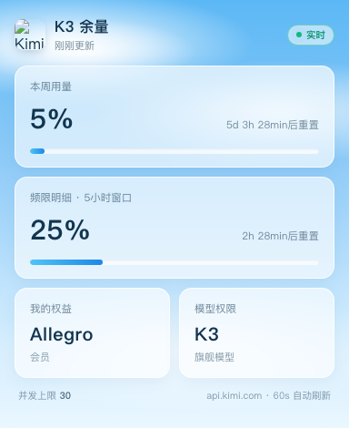

# K3 余量监控 (k3-monitor)

macOS 菜单栏常驻的 Kimi K3（Coding Plan）用量监控工具：本周用量、频限倒计时、套餐权益，一眼掌握。



## 功能

- **菜单栏常驻**：剩余量圆环 + 百分比数字，60 秒自动刷新，睡眠唤醒即刷
- **点开出卡片**：
  - 本周用量（已用 % + "Xd Xh Xmin后重置" 倒计时，秒级跳动）
  - 频限明细（5 小时窗口用量 + 倒计时）
  - 我的权益（套餐显示名，如 Allegro）
  - 模型权限（K3 旗舰模型）、并发上限
  - 用量 ≥70% 进度条变黄，≥90% 变红
- 蓝天白云 UI（纯 CSS 天空 + 云团，卡片毛玻璃）
- 右键菜单：立即刷新 / 退出
- 开机自启（launchd）

## 数据来源

Kimi 官方未公开文档的用量接口（从其官方 [kimi-cli](https://github.com/MoonshotAI/kimi-cli) 源码中发现）：

```
GET https://api.kimi.com/coding/v1/usages
Authorization: Bearer <你的 Coding Plan key>
```

返回周额度（`usage.limit/remaining/resetTime`）、5 小时窗口（`limits[0].detail`）、套餐（`user.membership.level`）、并发上限（`parallel.limit`）。

## 前置条件

1. macOS（Apple Silicon / Intel 均可）
2. Kimi Coding Plan 订阅的 API key
3. key 放在以下任一位置：
   - 环境变量 `KIMI_API_KEY`
   - [Hermes Agent](https://hermes-agent.nousresearch.com) 用户：`~/.hermes/config.yaml` 里名为 `kimi-coding` 的 provider（开箱即用）

## 安装

### 菜单栏版（推荐）

```bash
cd menubar
./build.sh          # 需要 Xcode 命令行工具，自动下载 Kimi 图标并编译
```

装开机自启（把 plist 里的 `YOUR_USERNAME` 换成你的用户名后）：

```bash
cp ../launchd/com.user.k3monitorbar.plist ~/Library/LaunchAgents/
sed -i '' "s/YOUR_USERNAME/$USER/g" ~/Library/LaunchAgents/com.user.k3monitorbar.plist
launchctl bootstrap gui/$(id -u) ~/Library/LaunchAgents/com.user.k3monitorbar.plist
```

### 浏览器版（零依赖，纯 Python 标准库）

```bash
python3 server.py          # 打开 http://127.0.0.1:8899
# 或双击 启动K3监控.command
```

对应的开机自启模板：`launchd/com.user.k3monitor.plist`（同上替换用户名）。

## 卸载

```bash
launchctl bootout gui/$(id -u)/com.user.k3monitorbar   # 菜单栏版
launchctl bootout gui/$(id -u)/com.user.k3monitor      # 浏览器版
rm ~/Library/LaunchAgents/com.user.k3monitor*.plist
```

## 说明

- 本项目与月之暗面（Moonshot AI）无关，为个人开源工具。界面中使用的 Kimi 图标版权属月之暗面，不入库，`fetch-icon.sh` 从 App Store 公开接口下载仅供界面展示。
- 查询频率低（60 秒一次 + 服务端缓存），对 API 几乎无负担。

## License

[MIT](LICENSE)
